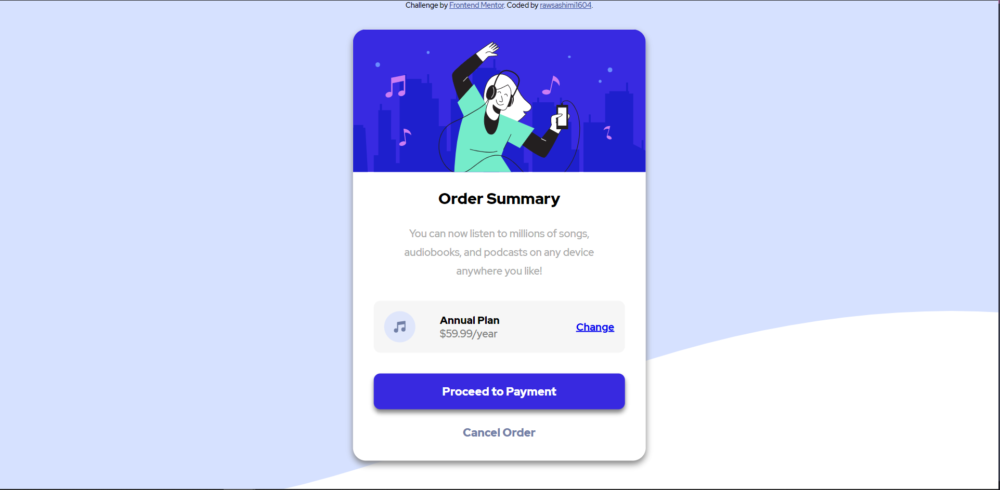

# Frontend Mentor - Order summary card solution

This is a solution to the [Order summary card challenge on Frontend Mentor](https://www.frontendmentor.io/challenges/order-summary-component-QlPmajDUj). Frontend Mentor challenges help you improve your coding skills by building realistic projects.

## Table of contents

- [Overview](#overview)
  - [The challenge](#the-challenge)
  - [Screenshot](#screenshot)
  - [Links](#links)
- [My process](#my-process)
  - [Built with](#built-with)
  - [What I learned](#what-i-learned)
  - [Continued development](#continued-development)
- [Author](#author)

**Note: Delete this note and update the table of contents based on what sections you keep.**

## Overview

### The challenge

Users should be able to:

- See hover states for interactive elements

### Screenshot

### Links

- Solution URL: [Vercel](https://vercel.com/rawsashimi1604/order-summary-component/2Mtjb1mxFUX7Fs99fN5UDz8b573m)

## My process

Started out with mobile first, adding basic HTML elements into divs to compartmentalize it. Then added styles such as flexbox margin and padding to really get the elements in the right direction, before moving to style it nicely. Also used the style-guide.md to choose good colors for the project! Finally I deployed using Vercel.

### Built with

- Semantic HTML5 markup
- CSS custom properties
- Flexbox
- CSS Grid
- Mobile-first workflow

### What I learned

I learnt how to use flexbox to design my layouts. Also practiced basic CSS styles like position, margin and padding. Overall it was a very enriching experience practicing on a real-life project!

### Continued development

I would say I need more experience and practice with flexbox. I am still having some trouble understanding some of flexbox.

## Author

- Github - [rawsashimi1604](https://github.com/rawsashimi1604)
- Frontend Mentor - [@rawsashimi1604](https://www.frontendmentor.io/profile/rawsashimi1604)
